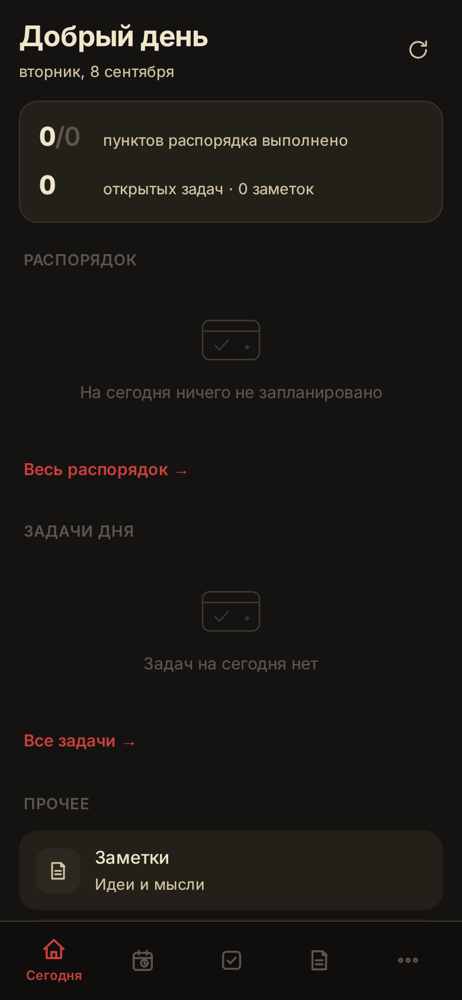
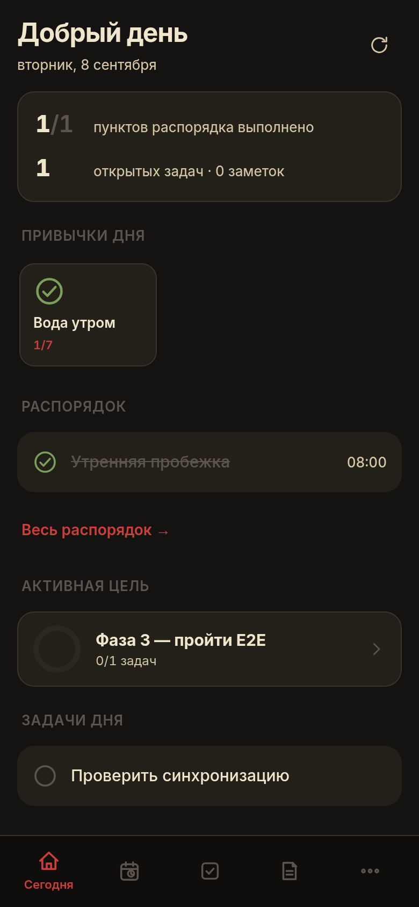
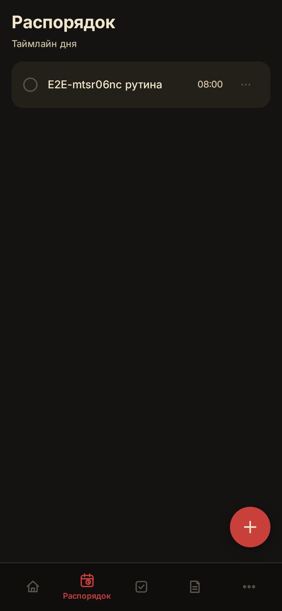
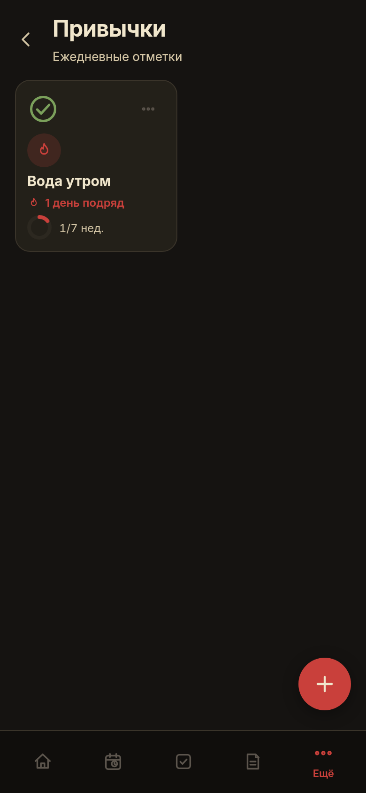
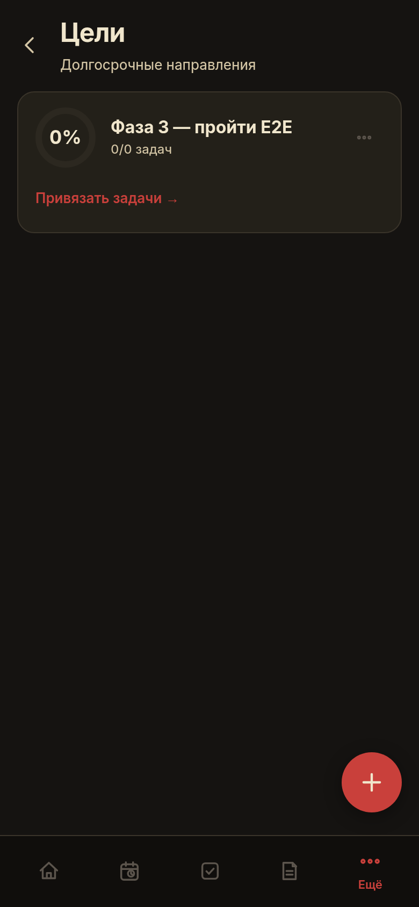
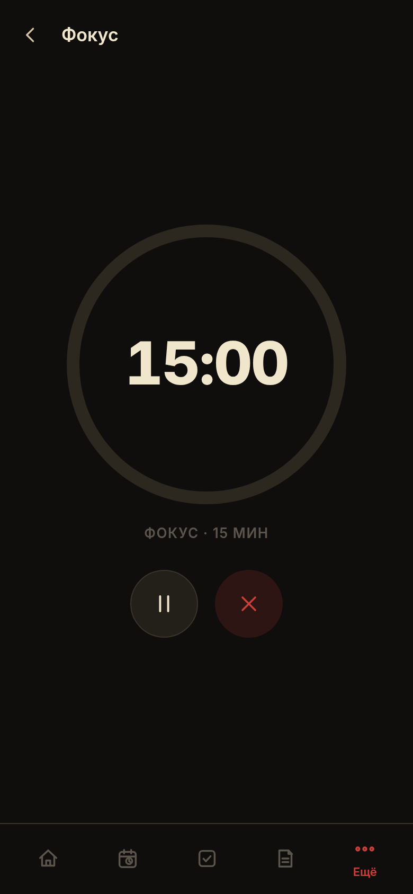

# SelfFlow 2.0

Планер саморазвития для Android: распорядок дня, задачи, заметки, привычки, цели, фокус-таймер, будильник, статистика и утренний дайджест дня.

## Стек

- **Svelte 5 + TypeScript + Vite** — интерфейс и логика приложения (`web/`)
- **Capacitor** — нативная Android-оболочка (`web/android/`)
- **SQLite на устройстве** — локальное хранилище (@capacitor-community/sqlite, в браузере sql.js); приложение работает полностью офлайн
- **PocketBase** (self-hosted) — бэкенд синхронизации
- **Offline-first sync** — изменения пишутся локально и в очередь, отправляются на сервер при появлении сети; pull по `updated`-метке с last-write-wins

## Скриншоты

| | |
|---|---|
|  |  |
|  |  |
|  |  |

## Что реализовано

- **Распорядок дня**: события с временем, повторением (нет/ежедневно/по будням/еженедельно), категорией и текстом уведомления; отметки выполнения, шаблоны рутин.
- **Задачи**: статусы (к выполнению / в работе / выполнено), приоритет, срок, привязка к рутине и цели, свайп-действия.
- **Заметки**: заголовок, текст, теги, поиск.
- **Привычки**: цель в неделю, тепловая карта выполнений, напоминания.
- **Цели**: дедлайн, заметка, привязка задач.
- **Фокус-таймер** сессий с привязкой к задаче.
- **Будильник**: wake/sleep-оверлей «поверх окон» + локальные напоминания рутин, привычек и задач.
- **Дайджест дня** по времени подъёма.
- **Статистика** выполнения.
- **Бэкап**: экспорт/импорт JSON v2 (все данные в одной транзакции, с заменой id и сохранением связей), импорт бэкапов legacy-приложения v1.
- **Безопасность входа**: PIN-код (PBKDF2) и биометрия.
- **Темы**: тёмная и светлая.

## Сборка APK

Требуется JDK 21 и Android SDK (platforms;android-36, build-tools;36.0.0 — см. `web/android/variables.gradle`).

```bash
cd web
npm ci
npm run build
npx cap sync android
cd android
./gradlew assembleDebug
```

APK: `web/android/app/build/outputs/apk/debug/app-debug.apk` (debug-подпись).

Каждый пуш в `master` собирает APK через GitHub Actions и выкладывает в [GitHub Releases](https://github.com/DARKPIX404/SelfFlow/releases) (workflow: `.github/workflows/build-apk.yml`).

## Локальная разработка

```bash
cd web
npm ci
npm run dev        # vite dev-server (sql.js в браузере)
npm run check      # svelte-check + tsc
```

Сервер PocketBase задаётся через `VITE_PB_URL` (см. `web/.env.example`).

Сайт с кнопкой скачивания всегда актуальной версии: [darkpix404.github.io/SelfFlow](https://darkpix404.github.io/SelfFlow/) (статика в `docs/`, публикуется через GitHub Pages).

## Legacy: нативное приложение (`app/`)

Каталог `app/` — первое поколение SelfFlow (Kotlin + Jetpack Compose, Room, AlarmManager + WorkManager, виджеты Glance, экспорт/имп Gson). Хранится для истории; активная разработка ведётся в `web/`.

## Дизайн

См. [docs/DESIGN_AND_UI_GUIDE.md](docs/DESIGN_AND_UI_GUIDE.md) и [docs/DESIGN_SYSTEM.md](docs/DESIGN_SYSTEM.md) — принципы Material Design 3, motion, accessibility, дизайн-токены.
